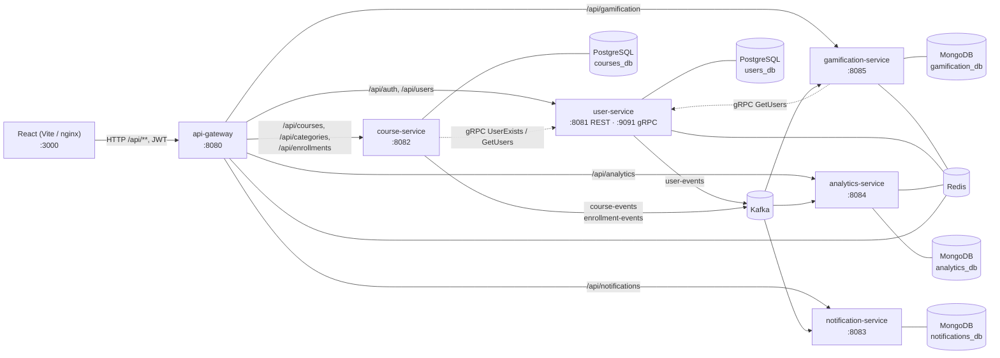

# JazzLMS — учебная микросервисная платформа (клон TalentLMS)

Проект для занятий: показать студентам, **как устроено реальное веб-приложение целиком** —
от кнопки во фронтенде до записи в базе, через gateway, микросервисы, Kafka, gRPC и Redis.

Функционально повторяет админку TalentLMS: пользователи и роли, курсы и категории,
запись на курс, **роль Instructor с уроками (видео, презентации, текст)**, Events Engine (уведомления + история), дашборд с графиком, таймлайн.

## Стек

| Слой | Технология | Где смотреть |
|---|---|---|
| Язык / фреймворк | **Java 21**, **Spring Boot 3.5** | `services/*` |
| Сборка | Gradle (Kotlin DSL), мультипроект | `build.gradle.kts`, `settings.gradle.kts` |
| API Gateway | **Spring Cloud Gateway** (WebFlux), JWT-фильтр, rate limiting | `services/api-gateway` |
| REST API | Spring MVC, Bean Validation, RFC 7807 Problem Details, Swagger UI | `*/web/*Controller.java` |
| SQL | **PostgreSQL** + Spring Data JPA (Hibernate) + **Flyway** миграции | `user-service`, `course-service` |
| NoSQL | **MongoDB** + Spring Data Mongo | `notification-service`, `analytics-service` |
| Кэш / счётчики | **Redis**: `@Cacheable`, HINCRBY, ZSET, token bucket | `user-service`, `analytics-service`, `api-gateway` |
| Асинхронные события | **Apache Kafka** (KRaft), Spring Kafka, JSON-сообщения | `common/events`, `*/kafka/*` |
| Синхронный RPC | **gRPC** + Protobuf (user-service ⇄ course-service) | `common/proto`, `*/grpc/*`, `*/client/*` |
| Аутентификация | JWT (jjwt), BCrypt | `JwtService`, `JwtAuthFilter` |
| Наблюдаемость | Actuator, Micrometer → **Prometheus**, Tracing → **Zipkin**, Kafka UI | `docker-compose.yml` |
| Геймификация | **gamification-service**: очки, уровни, бейджи; Kafka → MongoDB, лидерборд в Redis ZSET, имена по gRPC | `services/gamification-service` |
| Файлы уроков | **S3-хранилище** (RustFS, совместим с MinIO; клиент — MinIO Java SDK): видео и презентации, presigned URL, multipart upload | `course-service/storage`, `UnitController` |
| Логи | **Grafana + Loki + Promtail**: логи всех контейнеров в одном UI, traceId → Zipkin | `infra/grafana`, `infra/loki`, `infra/promtail` |
| Фронтенд | **React 18 + Vite**, React Router, Recharts, nginx | `frontend/` |
| Инфраструктура | **Docker Compose**, multi-stage Dockerfile | `docker-compose.yml`, `*/Dockerfile` |
| Тесты | JUnit 5, Mockito, `@WebMvcTest` | `*/src/test` |

## Архитектура



Подробный разбор каждого сервиса, потоков данных и «почему так» — в [docs/ARCHITECTURE.md](docs/ARCHITECTURE.md).

## Быстрый старт

Нужны: **Docker Desktop**, **JDK 21**, **Node 20+** (только для dev-режима фронта).

> **Студентам:** пошаговая инструкция с проверками, списком портов и разбором типичных ошибок —
> [docs/SETUP.md](docs/SETUP.md).

### Вариант 1 — всё в Docker (для демонстрации)

```bash
./gradlew build                                 # собрать jar-ы и прогнать тесты
docker compose --profile app up -d --build      # поднять инфраструктуру + 6 сервисов + фронт
```

Откройте <http://localhost:3000>. Логины: администратор `admin` / `admin123`, преподаватель `instructor` / `instructor123`.

```bash
docker compose --profile app logs -f            # смотреть логи всех сервисов
docker compose --profile app down -v            # остановить и удалить данные
```

### Вариант 2 — инфраструктура в Docker, сервисы из IDE (для разработки)

```bash
docker compose up -d                            # только Postgres, Mongo, Redis, Kafka, Zipkin, Kafka UI
./gradlew :services:user-service:bootRun        # каждый сервис — отдельным Run в IntelliJ
./gradlew :services:course-service:bootRun
./gradlew :services:notification-service:bootRun
./gradlew :services:analytics-service:bootRun
./gradlew :services:gamification-service:bootRun
./gradlew :services:api-gateway:bootRun
cd frontend && npm install && npm run dev       # http://localhost:5173, /api проксируется на :8080
```

Все адреса в `application.yml` по умолчанию смотрят на `localhost`, поэтому ничего настраивать не нужно.

> Kafka и MongoDB на хосте слушают **19092** и **27019** (а не 9092/27017), чтобы не конфликтовать
> с другими проектами на той же машине. Внутри docker-сети — стандартные порты.

## Что где открыть

| Что | URL |
|---|---|
| Приложение | http://localhost:3000 |
| Swagger user-service | http://localhost:8081/swagger-ui.html |
| Swagger course-service | http://localhost:8082/swagger-ui.html |
| Swagger notification-service | http://localhost:8083/swagger-ui.html |
| Swagger analytics-service | http://localhost:8084/swagger-ui.html |
| Swagger gamification-service | http://localhost:8085/swagger-ui.html |
| Kafka UI (топики, сообщения, consumer groups) | http://localhost:8090 |
| Zipkin (трассировка запроса через все сервисы) | http://localhost:9411 |
| **Grafana** — логи всех сервисов, метрики, трейсы (admin / admin, просмотр без логина) | http://localhost:3001 |
| Prometheus (сырые метрики, targets) | http://localhost:9090 |
| Консоль S3-хранилища (RustFS) — бакет `lms-content` с файлами уроков (jazzlms / jazzlms-secret-key) | http://localhost:9003/rustfs/console/ |
| Health любого сервиса | http://localhost:808x/actuator/health |

## Сценарий для демонстрации на занятии

1. **Логин** `admin/admin123` → user-service проверяет BCrypt-хэш, выдаёт JWT, шлёт `USER_LOGGED_IN` в Kafka.
   Redis: появился счётчик `stats:logins:<дата>`. Дашборд показывает +1 логин.
2. **Users → Add user** → `POST /api/users`. Gateway проверил JWT и роль, user-service записал в PostgreSQL,
   отправил `USER_CREATED`. notification-service нашёл правило «User addition (from an admin)» и
   «отправил» письмо → вкладка **History**. analytics-service записал событие в Mongo → **Timeline**.
3. **Courses → открыть курс → Enroll** → course-service **по gRPC** спрашивает user-service, существует ли
   пользователь (посмотрите `UserClient.java`), сохраняет запись, публикует `USER_ENROLLED`.
4. **Complete** (прогресс 100%) → `COURSE_COMPLETED` → письмо + зелёная линия на графике.
5. Откройте **Zipkin**, найдите трейс `POST /api/courses/{id}/enrollments` — видно gateway → course-service → gRPC → user-service.
6. Откройте **Kafka UI** → топик `enrollment-events` → посмотрите JSON сообщения и две consumer group.
7. `docker exec jazzlms-redis-1 redis-cli KEYS '*'` — кэш пользователей, счётчики, rate limiter.
8. Зайдите под учеником (создайте его с ролью Learner) — `GET /api/users` вернёт **403**: роли проверяет gateway.
9. Откройте **Grafana → Dashboards → JazzLMS**: логи всех пяти сервисов в одном окне. Выберите сервис,
   уровень `ERROR`, введите слово в «Поиск». Разверните строку лога — поле `traceId` кликабельно и ведёт в Zipkin.
   Ниже — метрики: RPS, p95 latency, heap, Kafka, пул соединений с PostgreSQL.
10. Сломайте что-нибудь (например, `docker compose stop user-service` и попробуйте записать на курс) —
    и найдите ошибку в Grafana, не заходя в терминал.

## Роли и уроки (Instructor)

| Тип пользователя | Режимы в шапке | Что может |
|---|---|---|
| SuperAdmin / Admin | Administrator · Instructor · Learner | всё: пользователи, любые курсы и уроки, уведомления |
| Instructor (`TRAINER`) | Instructor · Learner | создавать курсы, добавлять уроки в **свои** курсы, записывать учеников, видеть прогресс |
| Learner | Learner | проходить уроки курсов, на которые записан |

Переключатель режима (как в TalentLMS) меняет только вид интерфейса; права проверяет бэкенд:
gateway по роли из JWT, а course-service — по конкретному курсу (преподаватель ли ты именно здесь).

Сценарий: войдите как `instructor` → **Add course** → на странице курса **Add → Video / Presentation | Document / Content**.
- Video: ссылка YouTube или загрузка файла (до 300 МБ, с индикатором прогресса).
- Presentation: pdf показывается прямо в уроке, ppt/pptx/doc/docx — кнопка скачивания.
- How to complete it: *With a checkbox*, *With a question* (ответ проверяет сервер), *After a period of time* (сервер помнит время старта).
- Страница урока — на всю ширину, как в TalentLMS: своя шапка (назад, выбор урока, EDIT / ADD / MORE),
  собственный плеер над `<video>` (Play, перемотка, скорость 0.5–2x, громкость, полный экран), описание под уроком
  и кнопка **Complete**, после которой открывается следующий урок. В форме урока: **Autoplay**,
  **Show playback speed option**, Description, кнопки **Deactivate** и **Delete**.
- Вкладка **Users & progress** → запишите ученика, войдите под ним и пройдите уроки: прогресс курса считается
  автоматически, на 100% уходит событие `COURSE_COMPLETED` (письмо, таймлайн, график).

## Главная ученика и геймификация

Режим **Learner** повторяет главную TalentLMS: панель показателей (courses in progress, training time, badges,
points, level), курсы по категориям с прогрессом и бейджем INSTRUCTOR, поиск, сортировка Name / Date / Status,
вид списком или плиткой. Справа — **Course catalog** (самозапись на открытые курсы) и **Progress**.

Зелёная кнопка **N POINTS** в шапке открывает **Leaderboard** с вкладками Points / Levels / Badges и кнопкой
«How to collect points». Правила (`gamification-service`, класс `Rules`):
- вход +10 (раз в день), пройденный урок +15, завершённый курс +100;
- уровень L наступает при 100·(L−1)·L/2 очках: 2-й — 100, 3-й — 300, 4-й — 600, 5-й — 1000;
- бейджи за логины (1 / 5 / 25), уроки (1 / 10 / 50) и курсы (1 / 5).

Сервис не принимает команд от пользователя: всё, что он знает, пришло из Kafka. Это удобный пример
«событийного» сервиса, который можно добавить в систему, не трогая остальные.

## Главная администратора: три вида правой панели

Иконки в правом верхнем углу панели переключают вид (выбор запоминается в браузере):
- **лента** — последние события одной строкой и кнопка **Extended Timeline** в полный отчёт;
- **график** — логины и завершения курсов за Today / Yesterday / Week / Month;
- **таблица** — Overview (active users, active courses, assigned courses, completions, in progress, training time)
  и Today / Week с изменением в % к предыдущему периоду.

Таблица собирается из трёх сервисов тремя запросами: `/api/users/stats`, `/api/courses/stats`, `/api/analytics/summary`.

## Страница курса преподавателя, Rules & path, отчёты по курсу

- Боковая панель курса: **Content**, **Users & progress**, **Files** (файлы уроков), **Rules & path**, **Reports**.
  Кнопки Add ▾, Reorder (стрелки появляются только в этом режиме), Edit course, View as Learner и меню «…»:
  скрыть/показать в каталоге, **Lock / Unlock course content**, деактивировать.
- **Rules & path (sequential)** — бизнес-правило на сервере: при включённом флаге ученик не откроет урок,
  пока не пройдёт все предыдущие активные; в списке такие уроки помечены замком, `POST /start` отвечает 403.
- Edit course: вкладки Course / Users, переключатель Info / Reports, **Update course ▾** (and add another / and go
  to users), **Go to course content ▾** с **Clone** (копия курса и уроков; файлы копируются внутри MinIO) и **Delete**.
- **Reports** по курсу: Overview (назначено / завершили / в процессе / преподаватели / время, график назначений
  и завершений, «бублик» Not started), Users (прогресс, дата завершения, время, поиск, CSV, пагинация),
  **Unit matrix** (ученики × уроки: ✓ пройден, ○ начат; Options → показать время), Timeline по курсу.
- Форма документа: **Use a document from your files** (выбор из уже загруженных, файл копируется на стороне MinIO)
  или **Upload a document** (pdf, ppt, pptx, doc, docx, xls, xlsx). **Save and view ▾**: and back to units list /
  and continue editing. Ученик видит **Complete and continue**, если есть следующий урок.

## Карточка пользователя, отчёт Progress, ветки и группы

- Страница пользователя — вкладки **Info / Courses / Groups / Branches / Files** и переключатель
  **Profile / Progress / Infographic** справа, как в TalentLMS. Courses — записи с ролью и датами, Groups и Branches —
  членство с добавлением из списка, Files — файлы, которые пользователь загрузил в уроки.
- **Progress** — отчёт по пользователю: панель показателей, график активности за Today / Yesterday / Week / Month / Year
  (считается из MongoDB только по этому пользователю), «бублик» завершения, Recently earned и **Compared to others**
  (место в рейтингах по очкам, бейджам и уровню). **Infographic** — крупные цифры и все бейджи.
- **Branches** и **Groups** живут в user-service: список с наведением, форма (Identity, Locale, Announcement, Users),
  участники. Ветка — под-портал со своим языком, часовым поясом, типом пользователя по умолчанию и способом регистрации.
  Изменять может только администратор, читать — и преподаватель.

## Пользователи: действия, импорт, вход под пользователем

Страница **Users** повторяет TalentLMS:
- при наведении на строку появляются действия **Reports**, **Log into account**, **Edit**, **Delete**;
- **Reports** — отчёт по пользователю: профиль (user-service), курсы и прогресс (course-service), активность
  (analytics-service) на одной странице;
- **Log into account** — администратор входит под пользователем без пароля. Сверху жёлтая полоса
  «Return to my account». Нельзя войти под SuperAdmin и под деактивированным; событие видно в Timeline;
- **Add user ▾ → Import user(s)** — импорт из CSV с отчётом «создано / пропущено и почему»;
- внизу таблицы: **Save as CSV**, фильтр **Status** (Active / Inactive), поиск (имя, email, username);
- переключатель вида таблица / плитка.

## Отчёты: Reports → Timeline

Аналог *Reports → Timeline* в TalentLMS (плитка **Reports** на главной администратора):
- фильтры **From / To / Event / User / Course**, клик по цветной метке события тоже включает фильтр;
- свои действия показываются как «**You** signed in», подряд идущие логины схлопываются в «(22 times)»;
- серверная пагинация «1 to 10 of 86», кнопка **CSV** выгружает ленту с теми же фильтрами;
- удаление курса теперь **мягкое**: у события «deleted the course» есть кнопки **Undo delete** и
  **Permanently delete** (только администратор; окончательное удаление чистит и файлы уроков в MinIO);
- вкладка **Overview**: события по типам (агрегация `$group` в MongoDB) и самые активные пользователи (Redis ZSET).

## Account & Settings: регистрация, пароли, сертификаты, геймификация

Страница **Account & Settings** (плитка на главной администратора или меню пользователя). Работают четыре вкладки,
и каждая сохраняется **в своём сервисе** — так видно, что настройки в микросервисах не лежат в одной общей таблице:

| Вкладка | Сервис / хранилище | Что делает |
|---|---|---|
| Basic settings, **Users** | user-service, PostgreSQL `account_settings` (одна строка) | Signup: *Manually (from Admin)* запрещает `POST /api/auth/register` (403); *Default user type* и *Default group* для новых пользователей; **Password settings**: смена пароля через N дней, при первом входе (ответ логина содержит `mustChangePassword`, фронт ведёт на `/change-password`), **блокировка после N неудачных попыток на M минут**; Terms of Service (обязательная галочка на Sign up); Visible user format |
| **Certificates** | course-service, PostgreSQL `certificate_templates`, `certificates` | Шаблоны: выбор фона (8 CSS-пресетов), заголовок, текст с плейсхолдерами `{user} {course} {date} {code}`, Preview, Update, Save as new, Reset to default template, Delete. У курса есть поле «Certificate»; при 100 % прогресса course-service выдаёт сертификат с уникальным номером и шлёт `CERTIFICATE_ISSUED` в Kafka. Ученик видит сертификаты в My progress и печатает их в PDF из браузера |
| **Gamification** | gamification-service, MongoDB `settings` (один документ) | GAMIFICATION ON/OFF, очки за вход / урок / курс / сертификат, категории бейджей, уровни «каждые N очков / курсов / бейджей», вкладки таблицы лидеров, Reset to default settings, **Reset statistics** (стирает профили, рейтинги в Redis и журнал обработанных событий) |

Блокировка входа — хороший пример «зачем здесь Redis»: счётчик `login:fail:<login>` создаётся командой INCR, ему ставится
TTL = M минут, и аккаунт разблокируется сам, когда ключ истечёт (`docker exec jazzlms-redis-1 redis-cli TTL login:fail:aida`).
Homepage, Themes, E-commerce, Domain, Subscription и New interface оставлены только как заголовки вкладок.

## Тесты: банк вопросов, типы вопросов, попытки

**Add ▾ → Test** на странице курса открывает редактор как в TalentLMS: слева банк вопросов (**Select questions**:
Add / Remove, поиск, пагинация, «Show questions from all courses»), справа шаги **Set question order**, **Set question
weight**, **Test options** (Duration, Pass score, Randomization, Repetitions, Completion: что показывать после теста,
Description / Message if passed / if not passed) и ссылки **Add question**.

| Тип вопроса | Как хранится (`questions.data`, JSONB) | Как проверяется |
|---|---|---|
| Multiple choice | `{answers:[{text, correct}]}` | множество выбранных = множество правильных |
| Fill the gap | пропуски в тексте: `The quick [fox] ... [lazy\|slow] dog` | первый вариант в скобках — правильный; варианты через `\|` показываются списком |
| Ordering | `{items:[в правильном порядке]}` | ученику отдаются перемешанные, сравнивается порядок |
| Drag-and-drop | `{pairs:[{left, right}]}` | правая колонка перемешана, сверяются пары |
| Free text | `{threshold, options:[{mode, word, points}]}` | сумма баллов за ключевые слова ≥ threshold |
| Randomized | `{pool:[questionId]}` | при каждой попытке берётся случайный вопрос из пула |
| Import | формат AIKEN (текст: вопрос, `A.`/`B.`, `ANSWER: B`) | Preview = разбор без сохранения (`?dryRun=true`) |

Главное для студентов: **проверка только на сервере**. Ученик получает вопросы без правильных ответов
(`POST /api/units/{id}/test/attempts`), отправляет свои (`.../submit`), а `TestService.grade` сравнивает их с банком
и считает балл. Сданный тест закрывает урок (`UnitService.markCompleted`), в Kafka уходит `TEST_COMPLETED`
(лента событий, очки «Each successful test completion gives»), а в отчёте по курсу появляется колонка **Score**.
Попытка хранит вопросы в том виде, в каком их показали (перемешанные варианты, выбранный из пула вопрос) — поэтому
ответы по id вариантов проверяются корректно. Таймер: сервер отдаёт `deadline`, клиент отправляет тест сам по нулю.

## Структура репозитория

```
JazzLMS/
├── common/
│   ├── proto/      user.proto → gRPC-классы (генерируются при сборке)
│   └── events/     DomainEvent, EventType, Topics — контракт Kafka-сообщений
├── services/
│   ├── api-gateway/           маршрутизация, JWT, роли, rate limit, CORS
│   ├── user-service/          PostgreSQL, Flyway, Redis-кэш, gRPC-сервер, Kafka-producer
│   ├── course-service/        PostgreSQL, gRPC-клиент, Kafka-producer
│   ├── notification-service/  MongoDB, Kafka-consumer, @Scheduled
│   ├── analytics-service/     MongoDB + Redis, Kafka-consumer
│   └── gamification-service/  очки/уровни/бейджи: Kafka-consumer, MongoDB, Redis ZSET, gRPC-клиент
├── frontend/       React + Vite; src/api/client.js — единственная точка обращения к API
├── infra/
│   ├── postgres/init.sql    создаёт две базы (database-per-service)
│   ├── promtail/            сбор логов контейнеров -> Loki
│   ├── loki/                хранилище логов
│   ├── prometheus/          какие сервисы опрашивать за метриками
│   └── grafana/             datasources + готовый дашборд (provisioning)
├── docker-compose.yml
├── Makefile        make help
└── docs/ARCHITECTURE.md
```

## Задания для студентов

Идеи в порядке усложнения — см. раздел «Упражнения» в [docs/ARCHITECTURE.md](docs/ARCHITECTURE.md#упражнения).

SQL-задачи на реальных таблицах проекта (JOIN, агрегаты, оконные функции, JSONB, транзакции) —
[docs/SQL_EXERCISES.md](docs/SQL_EXERCISES.md), решения в `docs/sql/`.
