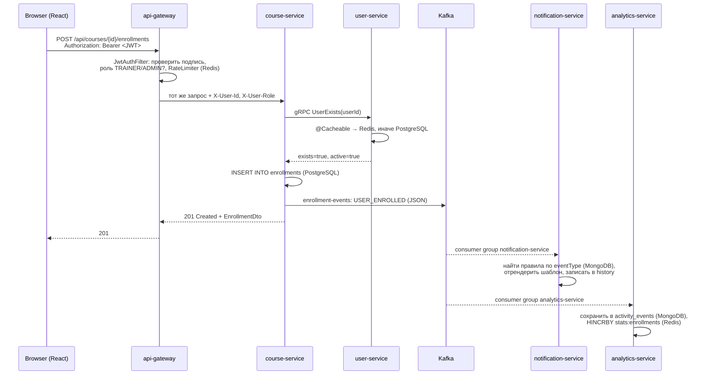
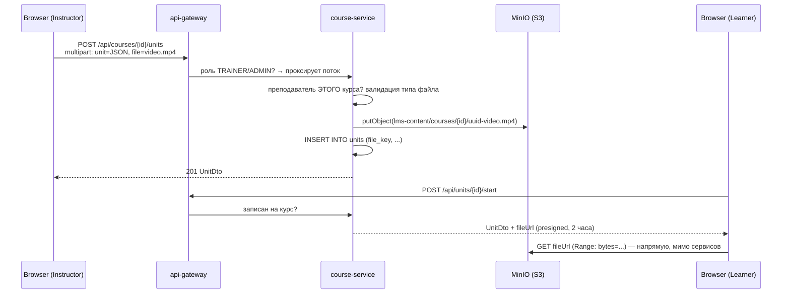
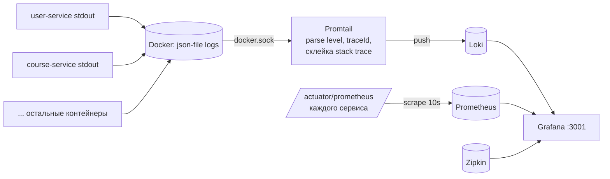

# Архитектура JazzLMS — разбор для студентов

## 1. Путь одного запроса

Возьмём кнопку **Enroll** на странице курса.

Обратите внимание:
- **Синхронно** (клиент ждёт ответа): браузер → gateway → course-service → gRPC → user-service.
- **Асинхронно** (клиент уже получил 201): Kafka → уведомления и аналитика. Если notification-service
  упадёт, запись на курс всё равно произойдёт, а событие дождётся его в топике.

## 2. Сервисы

### api-gateway (Spring Cloud Gateway, WebFlux)
- Единственный порт, который знает фронтенд. Маршруты — в `application.yml` (`routes:`).
- `JwtAuthFilter` — `GlobalFilter`: пропускает `/api/auth/login|register`, остальным нужен JWT.
  Проверяет подпись **тем же секретом**, что user-service (`jwt.secret`). Из claims достаёт `sub` (userId)
  и `role`, кладёт в заголовки `X-User-Id`/`X-User-Role`. Входящие такие заголовки **затирает** — иначе клиент
  мог бы выдать себя за админа.
- Роли: матрица в методе `authorized()`. Learner может читать курсы и менять **свой** прогресс, но не
  создавать пользователей.
- `RequestRateLimiter` — token bucket в Redis, ключ = userId или IP (`RateLimitConfig`).
- `HttpClientConfig` — почему нельзя кэшировать DNS в docker.

### user-service (PostgreSQL + Redis + gRPC-сервер + Kafka-producer)
- `V1__create_users.sql` — Flyway применяет миграции при старте и ведёт `flyway_schema_history`.
  `ddl-auto: validate` — Hibernate **не** трогает схему, только сверяет с сущностями.
- `User` (Entity) ≠ `UserDto` (то, что уходит наружу). Хэш пароля наружу не отдаём.
- `UserService.findById` помечен `@Cacheable("users")` → второй вызов идёт в Redis (`users::<uuid>`).
  `update`/`delete` — `@CacheEvict`. Посмотрите значение: `redis-cli GET users::<id>` — это JSON.
- `UserGrpcService` реализует `UserServiceGrpc.UserServiceImplBase`, сгенерированный из `user.proto`.
  Слушает порт 9091 (`grpc.server.port`).
- `UserEventPublisher` — `KafkaTemplate.send(topic, key=userId, event)`. Ключ важен: все события одного
  пользователя попадают в одну партицию → порядок сохраняется.
- `AuthService.login` — `PasswordEncoder.matches` (BCrypt), затем `JwtService.generate`.

#### Log into account (impersonation)

`POST /api/auth/impersonate/{userId}` выдаёт администратору JWT **другого** пользователя. Что показать студентам:
- токен обычный (sub = целевой пользователь), поэтому остальная система ничего особенного не замечает —
  gateway и сервисы видят ученика и дают ему права ученика;
- в токене есть claim `impersonatedBy` — след для аудита; плюс событие `USER_IMPERSONATED` в Kafka → Timeline;
- защита в два слоя: gateway пускает на путь только ADMIN/SUPER_ADMIN, `AuthService` запрещает цель SuperAdmin
  и деактивированных;
- фронт прячет исходную сессию в `localStorage` (`jazzlms.original`) и возвращает её кнопкой в жёлтой полосе.

#### Ветки, группы и составные ключи

`user_branches` и `user_groups` — таблицы-связки без своего id. В JPA это `@IdClass(Membership.Key.class)` с двумя
полями `@Id` в самой сущности. Первая версия объявляла их в общем `@MappedSuperclass` — Hibernate отказался
стартовать: «every property of the @IdClass must have a corresponding persistent property in the @Entity class».
Хороший пример, что ORM-магия имеет границы, и того, как читать ошибку запуска Spring Boot.

#### Импорт из CSV и поиск

- `UserImportService` намеренно **без** `@Transactional`: каждая строка — своя транзакция (`userService.create`),
  поэтому плохая строка не откатывает файл, а попадает в отчёт `skipped`. Bean Validation вызывается вручную через
  `Validator` — те же правила, что срабатывают на `@Valid` в контроллере.
- `UserRepository.search` — JPQL в `@Query` с необязательным фильтром (`:filterActive = false or ...`).
  Сравните: простые запросы — имя метода, несколько необязательных условий — `@Query`, много комбинаций —
  динамическая сборка (как `TimelineService` с `Criteria`).

### course-service (PostgreSQL + gRPC-клиент + Kafka-producer)
- Таблица `enrollments.user_id` — **без внешнего ключа**: users живут в другой базе. Это цена микросервисов:
  целостность проверяем через `UserClient.existsAndActive()` (gRPC), а не через FK.
- `enrollmentsOfCourse` показывает проблему N+1 по сети и её решение — batch-метод `GetUsers`.
- `CourseService.enroll` — единственный метод, где встречаются оба вида взаимодействия: gRPC (sync) и Kafka (async).

#### Уроки и файлы: multipart → MinIO → presigned URL

- `UnitController.create` принимает `multipart/form-data` из двух частей: `@RequestPart("unit")` — JSON,
  `@RequestPart("file")` — байты. Во фронте это `FormData` + `Blob` с типом `application/json` (`UnitForm.jsx`),
  а прогресс загрузки даёт `XMLHttpRequest.upload.onprogress` (`api/client.js`).
- `FileStorage` держит **два** MinIO-клиента: один ходит в хранилище по внутреннему адресу (`minio:9000`),
  второй только считает подпись для адреса, который видит браузер (`localhost:9002`). Подпись включает host,
  поэтому ссылку нельзя просто «переписать».
- Бакет закрыт: без подписи MinIO отвечает 403. Ссылка живёт 2 часа. Видео перематывается, потому что MinIO
  понимает `Range`-запросы — сервису не нужно реализовывать стриминг самому.
- Авторизация в два слоя: gateway пускает к «пишущим» `/api/units/**` только TRAINER/ADMIN, а
  `UnitService.canManage()` проверяет, что преподаватель записан на **этот** курс как INSTRUCTOR (или создал его).
- `VideoPlayer.jsx` — свой плеер над `<video>` без родных controls: состояние (paused/time/rate/volume)
  хранится в React, а сам элемент управляется через ref. Перемотка работает только потому, что MinIO отвечает
  на `Range`-запросы (206 Partial Content) — попробуйте отдать файл через обычный `GET` контроллера и перемотка пропадёт.
- Ответ на вопрос урока (`answer`) ученику не отдаётся вообще — иначе его видно в DevTools. Таймер
  «After a period of time» тоже проверяет сервер по `unit_progress.started_at`, фронтовый отсчёт — только удобство.
- Прогресс курса = пройденные активные уроки / все активные. На 100% `CourseService` публикует `COURSE_COMPLETED`.

#### Rules & path: бизнес-правило живёт на сервере

`courses.sequential` включает последовательное прохождение. Фронт лишь рисует замок по флагу `locked` из
`GET /units`; настоящая проверка — `UnitService.requireUnlocked` в `start`/`complete`: считаем активные уроки
с меньшей позицией и сравниваем с числом пройденных. Отключите проверку на фронте — сервер всё равно ответит 403.
Преподавателей и админов правило не касается (`manage`).

#### Clone и копирование файлов

`POST /api/courses/{id}/clone` копирует курс и уроки. Файлы уроков **копируются** внутри бакета
(`FileStorage.copy` → `CopyObject`, server-side: байты не проходят через сервис). Если бы копия ссылалась на тот же
ключ, «Permanently delete» одного курса сломал бы другой. Тот же механизм — у «Use a document from your files».

#### Отчёты по курсу

`CourseReportService`: overview и users — агрегаты по `enrollments` + нативный SQL для времени
(`sum(extract(epoch ...)) group by user_id`); unit matrix — `unit_progress` ученика по всем урокам курса.
Имена — один batch-вызов gRPC на весь список. График назначений/завершений — `TimelineService.courseActivity`,
общий код с активностью пользователя (`activity(scope, types, ...)`).

#### Мягкое удаление курсов

`V4__soft_delete_courses.sql` добавляет `deleted_at`. `DELETE /api/courses/{id}` только ставит пометку, все выборки
фильтруют `deleted_at IS NULL`. `POST /{id}/restore` снимает её («Undo delete»), `DELETE /{id}/permanent` удаляет строку
и файлы уроков в MinIO. Каждое действие — событие в Kafka (`COURSE_DELETED`, `COURSE_RESTORED`), поэтому отчёт Timeline
знает, что и когда удалили, и рисует кнопки. Преподаватель удаляет только свои курсы, корзина — только у администратора.

### notification-service (MongoDB + Kafka-consumer + @Scheduled)
- Это «Events Engine» TalentLMS. `NotificationRule` — правило (событие → получатель → шаблон),
  `NotificationMessage` — история/очередь. Оба — Mongo-документы, схемы и миграций нет.
- `EventListener` подписан сразу на три топика. `application.yml` настраивает `JsonDeserializer`
  на класс `DomainEvent` из `common/events`.
- Правила с `delayMinutes > 0` создают сообщение в статусе `PENDING`; `flushPending()` раз в 30 секунд
  отправляет то, чему пришёл срок. Это вкладка **Pending notifications**.
- «Отправка» — `log.info` + запись в Mongo. Замените на `JavaMailSender` — и это реальная рассылка.

### analytics-service (Redis + MongoDB + Kafka-consumer)
- Redis как **счётчики**: `HINCRBY stats:logins:2026-09-16 14 1`. График на дашборде = 24 поля хэша.
- Redis **sorted set** `leaderboard:active-users` — топ активных (`ZINCRBY`, `ZREVRANGE`).
- MongoDB — лента событий с уникальным индексом по `eventId` → повторная доставка из Kafka не создаст дубль
  (**идемпотентность** consumer'а).
- **Активность одного пользователя** (`TimelineService.userActivity`): Redis-счётчики общие на портал, поэтому серии по
  одному пользователю считаются из MongoDB — выбираем его события за период и раскладываем по часам или дням в Java.
  Сравните с глобальным графиком на главной, где данные уже агрегированы в Redis и запрос стоит O(1).
- **Summary для главной** (`StatsService.summary`): логины и завершения — суммы дневных счётчиков Redis,
  «users with activity» — `findDistinct("userId")` в MongoDB; рядом считается прошлый период и процент изменения.
  Training time в course-service — нативный SQL `sum(extract(epoch from (completed_at - started_at)))`:
  пример запроса, который в JPQL не выразить.
- **Timeline с фильтрами** (`TimelineService`): фильтры необязательны и комбинируются, поэтому запрос собирается
  динамически через `MongoTemplate` + `Criteria` — в том числе по вложенному полю `payload.courseId`.
  `count()` + `skip/limit` дают серверную пагинацию, `Aggregation.group("type")` — сводку для Overview.
  Сравните с JPA-репозиториями: там хватало имён методов, здесь комбинаций слишком много.
- Тот же топик читают два сервиса с разными `group-id` → каждый получает **все** сообщения (pub/sub).

### gamification-service (Kafka + MongoDB + Redis + gRPC-клиент)
- Появился **после** остальных сервисов и не потребовал менять ни один из них: подписался на те же топики
  своей consumer-группой. Это главный аргумент за события вместо прямых вызовов.
- `GamificationService.apply` — правила начисления. Идемпотентность через коллекцию `processed_events`
  с уникальным `_id = eventId` и TTL-индексом (7 дней): Kafka доставляет «хотя бы раз», очки дважды нельзя.
- Три лидерборда — три Redis ZSET (`ZADD` при изменении, `ZREVRANGE` + `ZREVRANK` при чтении: топ и «моя строка»).
- В Redis лежат только id, а ученику нельзя читать `/api/users`, поэтому имена сервис берёт сам —
  одним batch-вызовом gRPC `GetUsers`.
- «Вход даёт очки раз в день» — в профиле хранится `lastLoginDay`; сравните с analytics, где логины считаются все.

### common
- `common/proto` — единственный `.proto`; из него плагин генерирует и серверные, и клиентские классы.
- `common/events` — `DomainEvent` (record) и `EventType`. Producer и consumer компилируются против одного
  класса → формат не разъедется.

## 3. Данные: кто чем владеет

| Сервис | Хранилище | Данные |
|---|---|---|
| user-service | PostgreSQL `users_db` | users |
| course-service | PostgreSQL `courses_db` | categories, courses, enrollments, units, unit_progress |
| course-service | S3-бакет `lms-content` (RustFS; раньше MinIO, его образы сняли с публикации) | файлы уроков (видео, презентации) |
| notification-service | MongoDB `notifications_db` | notification_rules, notification_messages |
| analytics-service | MongoDB `analytics_db` + Redis | activity_events; stats:*, leaderboard:active-users |
| gamification-service | MongoDB `gamification_db` + Redis | profiles, processed_events; leaderboard:points / levels / badges |
| user-service | Redis | кэш `users::<id>` |
| api-gateway | Redis | `request_rate_limiter.*` |

Правило: **сервис ходит только в свою базу**. Нужны чужие данные — API (REST/gRPC) или события.

## 4. Почему SQL там, а NoSQL здесь

- Пользователи и курсы — связанные, структурированные данные с уникальными ограничениями → PostgreSQL.
- Правила уведомлений и лента событий — документы разной формы, схема будет меняться, JOIN-ов нет → MongoDB.
- Видео и презентации — большие бинарные файлы → объектное хранилище (MinIO/S3), в БД только ключ.
- Счётчики и кэш — нужна скорость и атомарный `INCR` → Redis (in-memory).

## 5. Наблюдаемость

- Каждый сервис отдаёт `/actuator/health` и `/actuator/metrics`.
- Micrometer Tracing добавляет `traceId` в логи (`[user-service,7f3a…,9c1b…]`) и отправляет спаны в Zipkin.
  Один `traceId` проходит через gateway, course-service, gRPC и user-service — откройте Zipkin и найдите его.
- Kafka UI показывает топики, партиции, сообщения и лаг consumer-групп.

### Логи: Grafana + Loki + Promtail

- Сервисы **ничего не знают** про Loki: пишут в stdout как обычно. Логи забирает Promtail через Docker API —
  это стандартный подход «12-factor app: логи как поток событий».
- Promtail (`infra/promtail/promtail.yml`) навешивает label `service` из имени compose-сервиса и вытаскивает
  `level` из строки. Loki индексирует только labels, поэтому запрос
  `{service="course-service", level="ERROR"}` быстрый, а полнотекст `|~ "gRPC"` идёт по сжатым чанкам.
- В datasource Loki настроен `derivedFields`: regex находит traceId в `[service,traceId,spanId]` и делает его
  ссылкой в Zipkin. Так от строки лога попадаем к полному трейсу запроса через все сервисы.
- Prometheus опрашивает `/actuator/prometheus` (Micrometer). Готовый дашборд `infra/grafana/dashboards/jazzlms.json`
  провижинится автоматически — ничего руками в Grafana настраивать не нужно.
- Почему не ELK/Kibana: Elasticsearch индексирует весь текст и требует 2–4 ГБ RAM; для занятий Loki
  (~100 МБ) достаточно, а Grafana заодно показывает метрики и трейсы. Kibana — тот же принцип, другой стек.

### Account & Settings: у каждого сервиса свои настройки

В TalentLMS это один экран, в JazzLMS — три владельца данных:

| Данные | Сервис | Хранилище | Почему здесь |
|---|---|---|---|
| Signup, роль/группа по умолчанию, политика паролей, ToS | user-service | PostgreSQL, таблица `account_settings` из одной строки (`id = 1`) | их проверяет логин и регистрация — код уже в этом сервисе |
| Шаблоны сертификатов и выданные сертификаты | course-service | PostgreSQL `certificate_templates`, `certificates` (UNIQUE user+course) | сертификат — следствие завершения курса, которое считает course-service |
| Очки, бейджи, уровни, таблица лидеров | gamification-service | MongoDB, документ `settings/default` | форма вложенная (points → login/unit/course/certificate), документ повторяет её один в один |

Поток «сертификат»: `UnitService.complete` → `CourseService.updateProgress` (100 %) → `CertificateService.issue`
(запись + событие `CERTIFICATE_ISSUED` в `enrollment-events`) → analytics-service пишет его в Timeline,
gamification-service начисляет очки «Each certificate gives». HTML сертификата рендерит course-service
(`GET /api/certificates/{id}/view`, владелец или staff); PDF получается печатью из браузера — без библиотек.

Политика паролей: `users.must_change_password` и `users.password_changed_at`; `AuthService.login` возвращает
`mustChangePassword`, а фронт ведёт на `/change-password`. Это UI-уровень: чтобы запретить API до смены пароля,
нужно добавить claim в JWT и проверку в gateway (упражнение). Блокировка после N неудачных попыток — счётчик в Redis
с TTL (`INCR` + `EXPIRE`), 423 Locked; успешный вход удаляет ключ.

Gateway: `/api/settings`, `/api/gamification/settings`, `/api/gamification/reset-statistics` и запись
`/api/certificates/templates` — только ADMIN; `/api/auth/settings` публичный (страница Login узнаёт, разрешён ли Sign up).

### Тесты (course-service, PostgreSQL + JSONB)

Таблицы `questions` (банк курса), `tests` (настройки, PK = id урока типа TEST), `test_questions` (состав, вес,
порядок, составной ключ через `@IdClass`), `test_attempts` (попытки). Разные типы вопросов имеют разную структуру
ответов, поэтому `questions.data` и `test_attempts.questions/answers/results` — колонки **JSONB**: Hibernate 6
сериализует `Map`/`List` через Jackson по аннотации `@JdbcTypeCode(SqlTypes.JSON)`. Это пример «документ внутри
реляционной БД»: схема таблицы стабильна, а форма данных гибкая — компромисс между SQL и NoSQL.

Поток: `POST /courses/{id}/tests` создаёт урок TEST и строку настроек → `PUT /units/{id}/test` меняет состав →
ученик `POST /units/{id}/test/attempts` (вопросы без правильных ответов, перемешанные по настройкам) →
`POST .../submit` → `TestService.grade` (все типы «всё или ничего», Free text — сумма баллов) → при сдаче
`UnitService.markCompleted` (общий с кнопкой Complete) → `TEST_COMPLETED` в `enrollment-events` → analytics
(Timeline), gamification (очки за сданный тест). Gateway: банк вопросов и `/tests` — только staff (в ответах есть
правильные ответы), `.../test/attempts` — любой записанный ученик.

## 6. Известные упрощения (о чём сказать студентам)

- Сервисы за gateway **доверяют** заголовку `X-User-Id`. В проде их порты не публикуют наружу
  (здесь опубликованы для Swagger и отладки).
- JWT-секрет и пароли БД лежат в `application.yml`/`docker-compose.yml`. В проде — Vault / secrets.
- Нет service discovery (Eureka/Consul): адреса сервисов заданы статически.
- Нет retry/circuit breaker при вызове gRPC (Resilience4j) — хорошее упражнение.
- Kafka в один брокер, `replicas=1`.

## Упражнения

1. **REST**: добавить `GET /api/users/{id}/enrollments` (course-service) — курсы конкретного пользователя.
2. **SQL/Flyway**: добавить поле `phone` в users через миграцию `V2__add_phone.sql`, протянуть до формы.
3. **Kafka**: новое событие `ASSIGNMENT_SUBMITTED` — эндпоинт в course-service, правило-уведомление
   «Course instructors» уже есть. Довести до письма в History.
4. **gRPC**: добавить метод `GetCourse` в course-service (новый `.proto`), вызвать из user-service.
5. **Redis**: закэшировать `GET /api/courses` с TTL 30 секунд, инвалидировать при изменении.
6. **NoSQL**: добавить в `NotificationRule` список условий (например, только для роли LEARNER).
7. **Gateway**: сделать rate limit разным для админов и учеников.
8. **Resilience**: обернуть `UserClient` в Resilience4j Retry + CircuitBreaker; убить user-service и посмотреть.
9. **Тесты**: интеграционный тест course-service с Testcontainers (PostgreSQL + Kafka).
10. **Frontend**: страница «My progress» для ученика с прогресс-барами по курсам.
11. **Observability**: сделать в Grafana alert «больше 5 ERROR за минуту в любом сервисе» и панель
    «лаг consumer-группы notification-service» (метрика `kafka_consumer_fetch_manager_records_lag_max`).
17. **Course reports**: колонка Score (нужен тип урока Test с баллами) и «Export in Excel» настоящим .xlsx через Apache POI
    вместо CSV; Reorder перетаскиванием (drag-and-drop) с одним запросом `PUT /units/order`.
16. **Gamification**: бейдж «Perfectionist» за курс, пройденный без единой ошибки в вопросах (нужно новое событие
    из course-service), и настройка очков администратором (страница Gamification settings + хранение правил в Mongo).
15. **Users**: массовые действия по чекбоксам (активировать / деактивировать / удалить выбранных) одним
    запросом `POST /api/users/bulk`; серверная пагинация списка пользователей.
14. **Timeline**: мягкое удаление и «Undo delete» для пользователей (по образцу курсов); перенести схлопывание
    логинов «(N times)» с фронта на сервер так, чтобы не ломалась пагинация.
13. **Уроки**: новый тип урока «Test» с несколькими вопросами и вариантами ответов; загрузка файла напрямую
    в MinIO по presigned **PUT** (минуя course-service); конвертация pptx → pdf отдельным сервисом через Kafka.
12. **Логи**: перевести сервисы на JSON-логи (`logback-spring.xml` + logstash-logback-encoder) и заменить
    regex в Promtail на `json` stage — так делают в проде.
18. **Account & Settings**: сделать `mustChangePassword` обязательным на сервере — добавить claim `pwdReset` в JWT
    и пропускать в gateway только `/api/auth/password`; вынести настройки в отдельный config-service с кэшем в Redis
    и событием `SETTINGS_CHANGED`, чтобы сервисы не читали БД на каждом запросе; генерировать PDF сертификата
    на сервере (OpenPDF) и складывать в MinIO.
19. **Тесты**: частичный балл за Multiple choice (доля верных вариантов), вопрос с картинкой (файл в MinIO),
    «Allow movement to next/previous question» (по одному вопросу на экран с сохранением черновика ответов в Redis),
    экспорт результатов теста в CSV и отчёт «самые сложные вопросы» (доля ошибок по `test_attempts.results`).
